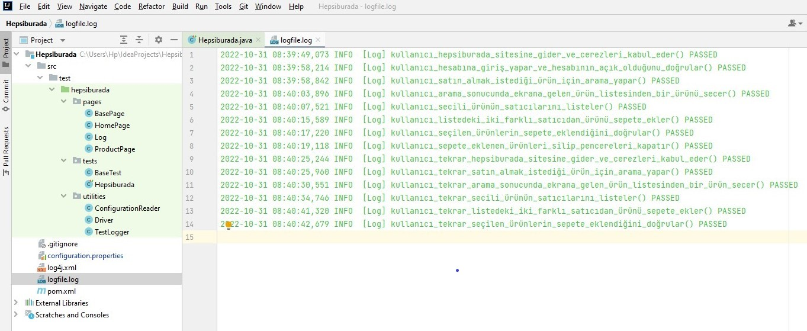

#  Hepsiburada for Patika.dev final case 
   This is a selenium project includes two scenarios which implemented with POM design pattern.
  
  ### Tools : 
   - Selenium (4.5.3)
   - Junit  (5.9.1)
   - log4j (1.2.17)
   
## Test Steps
- go to www.hepsiburada.com site
- sign in your account
- search any product
- select a product from the list
- list the product's merhcands
- put two products from different merchants to the basket
- assert the products are in the basket
- close the windows
- repeat all same steps without sign in

## Main packages and Log.
  

